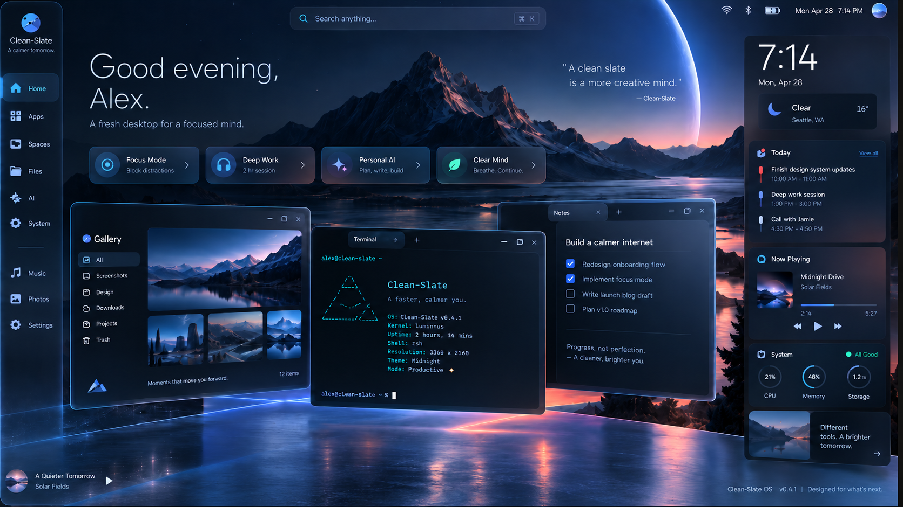
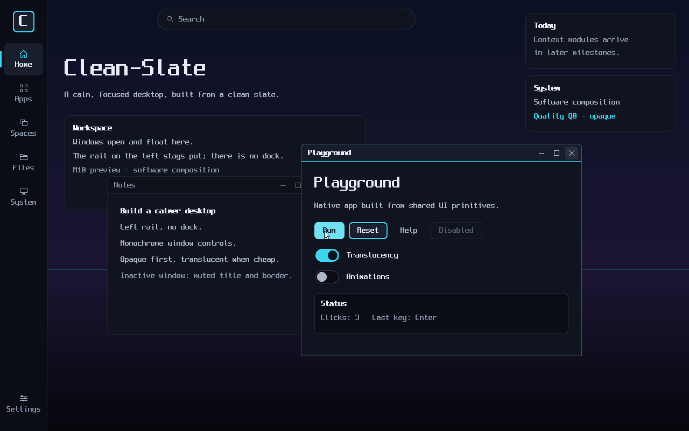
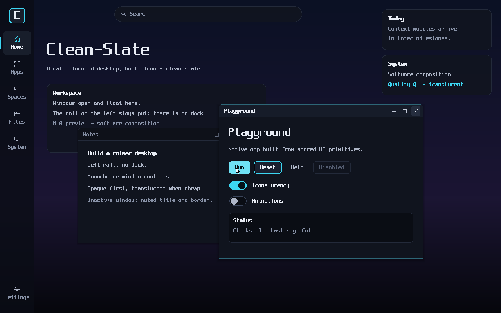

# Clean-Slate design system (M10)

This document specifies the Clean-Slate visual language as M10 implements it (#116). The code is authoritative. Token values live in one place, `ui/src/tokens.rs` (`clean_slate_ui::tokens::CLEAN_SLATE_DARK`), and every primitive reads them through a `Theme`. The tables below summarise those values. If they disagree with the code, the code wins.

Related: [GRAPHICS.md](../GRAPHICS.md) (frozen #110 contract: pixels, roles, buffer limits), [ARCHITECTURE.md](../ARCHITECTURE.md).

## North star versus M10 scope



**North-star reference (`docs/Desktop-design.png`). This is not an M10 feature checklist.** It shows where the visual language is heading: the cinematic wallpaper, global search, weather, calendar, media and system modules, an AI entry point, the gallery, terminal and notes apps, blur-heavy glass and photographic depth. M10 builds only the architectural ancestor of that desktop.

| Concept element | M10 |
|---|---|
| Persistent left rail | **Required.** Brand mark, five destinations and Settings, as built-in icons |
| Central workspace | **Required.** Static headline plus one workspace panel; windows float over it |
| Top global search | Static placeholder field, with no input or indexing |
| Right contextual stack | Static placeholder cards (`Today`, `System`) |
| Bottom dock | **Never.** No dock zone exists; the workspace reaches the bottom edge |
| Floating windows with custom chrome | Painted by `ChromeStyle`; behaviour belongs to #115 |
| Glass, blur, photographic wallpaper | Not in M10. Q0 is opaque, Q1 uses restrained translucency and no blur; the wallpaper is a computed gradient |
| Weather, calendar, media, AI, notifications | Not in M10 (#109 non-goals) |

M10 reference renders, produced from the real tokens and primitives by `cargo run -p clean-slate-ui --example render_reference -- docs/design`:

| Q0 (opaque) | Q1 (restrained translucency) |
|---|---|
|  |  |

These images are host previews painted into one buffer (`clean_slate_ui::reference::render`). The integrated desktop produces the same pixels from separate shell, app and compositor layers. CI never compares the image files. See [Verification](#verification).

## Visual principles

1. **Dark, high-contrast, cinematic.** Deep navy-black base, with a three-stop wallpaper gradient (night blue, dusk violet at the horizon, near-black at the bottom) and one thin cyan horizon line.
2. **Restrained accents.** Cyan is the single interactive accent: selection, primary action, focus, and the focused-window underline. Magenta and blue are reserved for sparing highlights. Status colours carry status only.
3. **Persistent left rail, no dock.** Navigation lives in the left rail. Nothing is anchored to the bottom edge.
4. **Understated monochrome chrome.** Window controls are thin neutral glyphs, never red/yellow/green. Titles are left-aligned.
5. **Generous spacing, crisp hierarchy.** A 4 px grid. Hierarchy comes from scale, weight and tone, because M10 has a single bitmap face.
6. **Depth is optional.** Every surface must look intentional at Q0, with no translucency or shadows. Effects only add to it.
7. **Distinctively Clean-Slate.** No imitation of macOS or Windows chrome: square controls on the right, a cyan underline for focus, a top-rounded frame and a square bottom.

## Semantic tokens

### Colour roles

All colours are sRGB with straight alpha (`Rgba`), premultiplied at paint time. They are blended with the shared `over()` from `clean_slate_graphics::pixel`.

| Role | Value | Use |
|---|---|---|
| `background` | `#06080D` | deepest base |
| `wallpaper_top` / `_horizon` / `_bottom` | `#0B1124` / `#1B1533` / `#05060B` | wallpaper gradient; the horizon sits at 5/8 of the height |
| `wallpaper_horizon_line` | `#1E4A5C` | one-pixel line at the horizon (opaque, pre-mixed) |
| `surface` | `#10141E` | panels, app content |
| `surface_raised` | `#181E2B` | selected rail item, raised states |
| `surface_sunken` | `#0A0D14` | toggle track, inset wells |
| `card` | `#10141E`; Q1 `#10141E` at alpha `0xD9` | cards on the wallpaper (`SurfaceFill`) |
| `rail` | `#0A0D15`; Q1 `#0A0D15` at alpha `0xCC` | rail background (`SurfaceFill`) |
| `rail_hover` | `#141925` | rail item under the pointer |
| `border_subtle` / `border_strong` | `#232A3A` / `#39445A` | resting / emphasised borders |
| `control` / `_hover` / `_pressed` | `#1A2030` / `#232B3D` / `#141924` | secondary controls |
| `text_primary` / `_secondary` / `_muted` / `_disabled` | `#E9EDF5` / `#AEB6C7` / `#8892A7` / `#535C70` | text tones |
| `text_on_accent` | `#04131A` | text on cyan |
| `accent_cyan` / `accent_magenta` / `accent_blue` | `#3CD6F2` / `#D06CF2` / `#6283FF` | accents |
| `primary_hover` / `primary_pressed` | `#6FE2F6` / `#22B3CF` | primary control states |
| `focus_ring` | `#3CD6F2` | keyboard focus |
| `success` / `warning` / `danger` | `#3DDC97` / `#F2C14E` / `#F2667E` | status only |
| `chrome_active_bar` / `chrome_inactive_bar` | `#161C29` / `#0E1119` | title bars |
| `chrome_active_border` / `chrome_inactive_border` | `#2D6676` / `#1E2430` | frame borders |
| `chrome_active_title` / `chrome_inactive_title` | `#E9EDF5` / `#828CA1` | titles |
| `chrome_control_active` / `_inactive` | `#C3CAD8` / `#687287` | control glyphs |
| `chrome_control_hover` / `_pressed` | `#252D3E` / `#2F384B` | control backgrounds |
| `chrome_accent` | `#3CD6F2` | focused title-bar underline |
| `shadow` | black at alpha `0x40` | Q1 window shadow |
| `cursor_fill` / `cursor_outline` / `cursor_accent` | `#F3F6FB` / `#04060A` / `#3CD6F2` | pointer |

A `SurfaceFill` pairs a translucent colour with an explicit opaque fallback. `Style::surface` picks one according to `Effects::translucency`, so a disabled effect never produces an accidental colour.

**Contrast (enforced by tests).** Primary and secondary text meet WCAG AA (≥ 4.5:1) on every surface they can appear on. Muted text meets 4.5:1 on backgrounds, cards and the rail. Text on accent meets 4.5:1. Both active and inactive window titles meet 4.5:1. Focus rings, toggle tracks and knobs, control glyphs and the focus underline meet ≥ 3:1 (WCAG 1.4.11). The cursor fill against its outline is ≥ 7:1.

### Spacing, radius, stroke

| Token | Values |
|---|---|
| Spacing (4 px grid) | `xxs 2`, `xs 4`, `sm 8`, `md 12`, `lg 16`, `xl 24`, `xxl 32` |
| Radius | `sm 4` (window controls), `md 8` (buttons, rail items, wells), `lg 12` (cards), `pill` (clamped to half the shorter side) |
| Stroke | `hairline 1`, `focus 2`, `indicator 3` (selected rail bar) |

Corners are rasterised at pixel centres without anti-aliasing, so they are crisp at Q0 and cost nothing extra.

### Typography

M10 maps the type scale onto the #111 Spleen 8×16 bitmap path (`Theme::font`) using integer scale, faux-bold (the run drawn twice, offset by 1 px) and tone. A future font stack replaces `Theme::font` and these rows. No widget changes.

| Role | Scale | Cell | Weight | Default tone | Use |
|---|---|---|---|---|---|
| `Display` | 3× | 24×48 | regular | primary | hero text |
| `Title` | 2× | 16×32 | regular | primary | app and section titles |
| `Heading` | 1× | 8×16 | strong | primary | card headings, focused window title |
| `Body` | 1× | 8×16 | regular | secondary | running text |
| `Label` | 1× | 8×16 | regular | primary | control labels |
| `Caption` | 1× | 8×16 | regular | muted | captions, metadata |

Text that does not fit is truncated on a character boundary and ends with `...`.

## Shell zones

```text
┌───────┬──────────────────────────────────────┬───────────┐
│       │      global search (placeholder)     │           │
│ left  ├──────────────────────────────────────┤  right    │
│ rail  │            workspace                 │  context  │
│       │                                      │  stack    │
│       │                                      │ (placeh.) │
└───────┴──────────────────────────────────────┴───────────┘
                     (no bottom dock)
```

`ShellZones::compute` places the zones as follows at the reference mode (1280×800, scale 1.0, `ShellConfig::M10`):

| Zone | Rect (x, y, w, h) | Notes |
|---|---|---|
| Rail | 0, 0, 88, 800 | always present, full height |
| Search band | 88, 0, 888, 72 | optional; the field is 480×40 and centred |
| Workspace | 88, 72, 888, 728 | always present; reaches the bottom edge |
| Context stack | 976, 0, 304, 800 | optional |
| Window area | 88, 0, 888, 800 | where the window manager should place toplevels (may cover the search band) |

The zones tile the output exactly, and nothing is placed below the workspace. `ShellConfig::MINIMAL` drops both placeholders. Later search, calendar, media and system modules fill the existing search and context zones, so the compositor and window architecture do not change.

**Rail layout.** It has an 80 px brand block, five 60 px destinations with 4 px gaps (Home, Apps, Spaces, Files, System), and Settings anchored 16 px above the bottom edge. A selected item has a `surface_raised` pill, a 3 px cyan indicator bar on the left edge, a cyan icon and a primary label. A hovered item has a `rail_hover` pill and primary text.

**Surfaces and layers.** The shell is an ordinary CPL3 compositor client holding the root `Graphics{GFX_CONNECT|GFX_SHELL}` grant, and `Shell::surfaces` lists what it creates:

| Surface | Role | Layer | Format | Buffers |
|---|---|---|---|---|
| Background: wallpaper, workspace panel, placeholders | `Background` | `Background` | `Xrgb8888` | 1 (static) |
| Rail | `ShellPanel` | `ShellFurniture` (above windows) | Q0 `Xrgb8888`, Q1 `Argb8888Premultiplied` | 2 (changes with hover) |

That is three buffers out of the 8-per-client limit, leaving a full 8-buffer app budget within the compositor-wide 16. The cursor is not a shell surface (see [Cursor](#cursor)).

## Native window chrome

The window manager (#115, `compositor::wm`) owns decoration behaviour: hit testing, move, resize, focus and stacking. The theme supplies only look and metrics, through the narrow `clean_slate_ui::chrome::ChromeStyle` trait, which `CleanSlateChrome` implements. Behaviour never reads the theme.

| Metric | Value |
|---|---|
| Title bar height | 32 (inside the border) |
| Border | 1 |
| Top corner radius | 8 (the bottom corners are square, so the client surface is never clipped) |
| Controls | 24×24, 4 px apart, 6 px from the right edge; order Minimize, Maximize/Restore, Close |
| Title padding | 12 (title left-aligned, truncated before the controls) |
| Resize margin | 6, invisible and outside the border |

Rules:

- **Monochrome controls.** Glyphs are 10×10 thin lines (a bar, a square or double square, a diagonal cross). Hover and press change only the neutral background. The close control is not red. A test asserts that every control pixel is near-grey.
- **Focused windows** get a `chrome_active_bar` title bar, a cyan-tinted `chrome_active_border`, a one-pixel cyan underline under the title bar, a strong `Heading` title in primary text, bright control glyphs and, at Q1, a stronger shadow.
- **Inactive windows** get a darker bar, a neutral border, a `border_subtle` underline, a regular-weight muted title, dimmed glyphs and, at Q1, a lighter shadow.
- The frame never paints the client content rect. `ChromeStyle::visual_rect` bounds everything the frame paints (shadow included) and is the damage rect for map, unmap, move and focus changes.

## Interaction and focus states

`WidgetState { hovered, pressed, focused, disabled }` is the only interaction input. Fill precedence is **disabled > pressed > hovered > rest**. Focus is independent and draws a 2 px cyan ring with a 1 px dark inner hairline, so it stays visible on cyan-filled controls. Every widget paints, focus ring included, strictly inside the bounds it is given, so a widget's damage on a state change is exactly its bounds (tested).

| Widget | Rest | Hover | Pressed | Disabled |
|---|---|---|---|---|
| Primary button | cyan, on-accent text | `primary_hover` | `primary_pressed` | `surface` + subtle border, disabled text |
| Secondary button | `control` + subtle border | `control_hover` + strong border | `control_pressed` + strong border | as above |
| Quiet button | text only (secondary) | `control_hover` fill | `control_pressed` fill | as above |
| Toggle (on / off) | cyan track, dark knob / sunken track with strong border, light knob | lighter track | darker track | raised track, disabled knob |
| Rail item | transparent | `rail_hover` pill | `surface_sunken` pill | disabled glyph |
| Card | subtle border | strong border | strong border | disabled heading |

Application state such as toggled values or the selected destination stays with the caller. Widgets are plain data.

## Primitives

These live in `clean_slate_ui::widgets`. Each has `measure(style)` (where meaningful) and `paint(canvas, style, bounds, state)`:

- `Text`: `display`, `title`, `heading`, `body`, `caption`, plus `with_tone`; single line, ellipsised to the bounds.
- `Card`: `Card` (rounded, bordered, translucent from Q1), `Panel` (flat), `Inset` (well); optional heading. `paint` returns the content rect.
- `Button`: `primary`, `new` (secondary), `quiet`, with an optional leading icon; 32 px tall.
- `Toggle`: `new(on)` and `labelled(on, label)`; a 44×24 track inside a 2 px focus margin.
- `RailItem`, `SearchField`, `divider`.
- Layout helpers (`clean_slate_ui::layout`): `RectExt` (inset, split, centre, contains), `Insets`, and `Flow` (an allocation-free row or column).

Native apps (#117) build their content from these with no compositor special cases. An app renders into its own `Toplevel` surface buffer with `Canvas::new(bytes, layout)`, paints widgets, and commits the resulting `Damage`.

## Icon placeholder strategy

M10 does not wait for an icon set. `Icon` provides 16×16 one-bit masks for the shell's own affordances (Home, Apps, Spaces, Files, System, Settings, Search), a generic `Placeholder` mark, and a `Monogram(char)` fallback that draws a letter in the icon cell for anything else. Masks scale by integers and are tinted by a tone colour. A real icon set later replaces the mask table and leaves the `Icon` call sites alone.

## Cursor

The visible pointer is a compositor-owned, trusted internal layer. It is never a client surface: the `Cursor` role is reserved and refused by `validate_role`. This crate supplies only its visual. `cursor::ARROW` is a 12×18 arrow with a near-white fill, a deep outline that reads on both light and dark content, and a cyan spine in the shared accent. `cursor_rect` gives the damage bounds for show, move and hide.

## Quality tiers and graceful degradation

| Tier | M10 | Surfaces | Effects |
|---|---|---|---|
| Q0 | **must succeed** | `Xrgb8888`, always opaque | none: opaque fallbacks, no shadow |
| Q1 | **must succeed** | `Argb8888Premultiplied` where translucent (rail) | restrained translucency (rail alpha `0xCC`, cards `0xD9`), cheap one-pixel-ring shadows |
| Q2 | future | | richer shadows and transitions |
| Q3 | future | | backdrop blur, premium effects |

`QualityTier::clamp_m10` maps Q2 and Q3 to Q1. `Effects` can switch translucency and shadows off individually, and blur and animation are always off in M10. With any effect disabled, the layout, zones, chrome geometry and state cues stay identical, and only fills change to their opaque fallbacks. The shell therefore stays usable and recognisable without blur, without translucency, without animation and with software composition only. Every state change is an immediate repaint of bounded damage, and nothing depends on a timer.

Blending happens in sRGB-encoded space with the shared `over()` rounding (`ColorSpace::Srgb`). Linear-light blending belongs to a later tier.

## Performance constraints and rendering-cost budget

- **Event-driven only.** Nothing redraws because time passed. `RailState::apply` returns empty damage when nothing visible changed.
- **Bounded damage.** A rail state change damages at most 2 item rects and at most 2×88×60 px (`RenderBudget`). Repainting with `surface::repaint` clips to the damage and gives the same bytes as a full repaint, without touching anything outside the damage (tested).
- **Static surfaces stay static.** The background is single-buffered and repainted only when the configuration or output mode changes.
- **Buffer budget.** The shell uses 3 buffers (see [Shell zones](#shell-zones)).
- **Cheap effects.** Q0 performs no blending at all: every shell pixel is a direct store, and the result does not depend on prior buffer contents (tested). Q1 shadows blend only one-pixel rings around the frame, so their cost scales with the perimeter rather than the area. Corners are not anti-aliased.
- **No allocation.** `clean-slate-ui` is `no_std`, allocation-free and `forbid(unsafe_code)`, and it builds for `x86_64-unknown-uefi`.
- **Damage for the protocol.** `Damage::batches(layout)` clips damage to the buffer and splits it into `Damage` request bodies of at most 5 rects (`DAMAGE_RECTS_PER_FRAME`). The set collapses to bounding boxes beyond 16 rects, as commit damage does.

## Verification

`cargo test -p clean-slate-ui` covers:

- **Token validation:** WCAG contrast, opaque fallbacks, grid alignment, and ordering of focused and inactive chrome.
- **Degradation:** tier clamping, Q0 full opacity, the premultiplied invariant and restrained alpha at Q1, and output independent of prior buffer contents.
- **Shell structure:** the zones tile the output, there is a full-height rail, there is no bottom zone, the bottom band outside windows is pure wallpaper, the buffer budget holds, and the shell roles require `GFX_SHELL`.
- **Interaction:** rail hover, press, cancel, keyboard focus, damage minimality and budget, and incremental repaint equal to full repaint.
- **Primitives:** containment inside bounds for every state and tier, distinct states, focused versus inactive chrome, monochrome controls, title truncation and cursor bounds.
- **Golden CRCs** of individual primitives at fixed sizes. Full frames are never hashed.
- **Structural probes:** `reference::probes(theme, tier)` lists named points with token-derived colours (rail background, rail edge, no dock at the bottom edge, focused and inactive title bars, focused underline, borders and cursor fill), checked against `reference::render` at every tier. Screenshot acceptance (#119) can reuse these probes against a QMP screendump instead of comparing exact full-frame hashes.

## Integration status

Done here: the tokens, primitives, chrome look and metrics, cursor visual, shell zones, surface plan, rail behaviour, and this specification. #115 wires them into the compositor: `compositor::wm::DefaultPolicy` paints `CleanSlateChrome` frames with live focus, hover and pressed state, places windows in `ShellZones::window_area`, and draws `ARROW` as the compositor-owned cursor layer. Still to come: the `desktop-shell/` binary (connect, create the two surfaces, register buffers, assign roles, attach, damage and commit, then forward rail input) and on-target screenshots.
